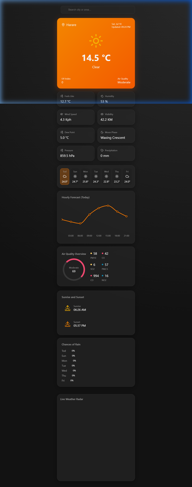

# Weather Dashboard

A beautiful, premium, glassmorphism-styled weather dashboard built with React and Vite. It pulls live weather data globally using the Open-Meteo API (no API key required).

## Features

- **Live Global Weather Data**: Powered by the free Open-Meteo API.
- **Auto-Location**: Detects your location via browser Geolocation on load and instantly loads your weather.
- **Smart Geocoding Search**: Search for any city in the world to instantly get weather data, powered by OpenStreetMap Nominatim.
- **Interactive Weekly Forecast**: Click any day in the 7-day forecast to instantly view its detailed hourly temperature trend chart.
- **Search History**: Automatically saves your recent searches so you can quickly jump back to favorite cities.
- **Live Weather Radar Map**: Includes a stunning, fully-interactive Windy.com map embedded at the bottom that automatically centers on your searched city.
- **Comprehensive Metrics**: Displays Feels Like, Dew Point, Moon Phase, UV Index, Air Quality (PM2.5, PM10, etc.), Sunrise, Sunset, Visibility, and more.

## Tech Stack

- React
- Vite
- Recharts (for hourly forecast visualization)
- Lucide React (for beautiful vector icons)
- Vanilla CSS (for the glassmorphism design system)

## Getting Started

1. Clone this repository
2. Run `npm install`
3. Run `npm run dev`
4. Visit `http://localhost:5173` in your browser.

No API keys are required!
